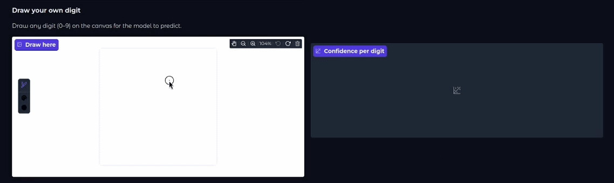

<div align="center">

  

# Digit Classifier
</div>

### A handwritten digit classifier built using Python, [PyTorch](https://github.com/pytorch/pytorch), [Gradio](https://github.com/gradio-app/gradio) and the [MNIST dataset](http://yann.lecun.com/exdb/mnist/)

> train your own model, then test it on a test set or on digits you draw yourself

<div align="center">

  ---
  [**Features**](#features) | [**Install**](#install) | [**How it works**](#how-it-works)

  ---

</div>

## Features

🧠 **Train your own model**: Download the MNIST dataset, tune epochs, batch size, learning rate and weight decay

📊 **Evaluate**: Run the model on the 10,000 test images and get per-digit accuracy plus a confusion matrix

✏️ **Draw your own digit**: Sketch any digit (0-9) on the canvas and get an prediction with confidence scores

🖥️ **All in one place**: Everything runs from a single Gradio interface

<div align="center">

  

</div>

## Install

1. **Clone the repository**
```
git clone https://github.com/ris5266/digit_classifier.git
```

2. **Install the dependencies**
```
pip install -r requirements.txt
```

3. **Launch the app**
```
python app.py
```

## How it works

The model is a fully connected neural network (784 → 256 → 128 → 10) trained on MNIST with:
- Backpropagation
- Adam optimizer
- Regularization (Dropout + L2 weight decay)
- Softmax output

Drawn digits are normalized to match MNIST before prediction: the stroke is cropped to its bounding box, scaled to fit a 20px box, thickened, and centered by its center of mass inside a 28x28 frame.
